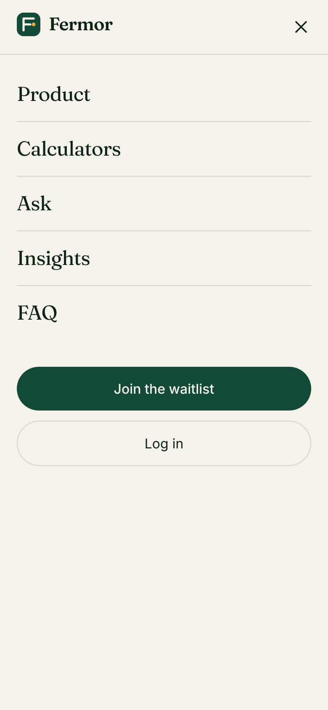

# Fermor homepage

My take on a new homepage for Fermor. Built with Next.js, React (JavaScript) and Tailwind CSS.

Live: https://fermor-homepage-lyart.vercel.app/
Code: https://github.com/dharshan6361/Fermor-homepage

## Run it

```
npm install
npm run dev
```

Then open http://localhost:3000.

## Screenshots

Desktop


Mobile




## What I did

Fermor's site is half free calculators and half a bigger investing app. I wanted the homepage to show both, so the top of the page is a working SIP calculator rather than a picture. You move the sliders and the result changes, and "Show the maths" shows the formula with your numbers in it. That fits Fermor's "no black boxes" idea.

Below that:

- Understand / Act / Grow as three tabs, each with a small interactive demo
- A grid of calculators linking to the real ones on fermor.in
- A sample "Ask" chat (scripted, no AI behind it)
- A few principles, three article cards, FAQ, a waitlist form and a footer

## Choices

- Colours: cream background with dark green. I stayed away from the usual blue fintech look.
- Fonts: Fraunces for headings and big numbers, Inter for everything else.
- Amounts use Indian formatting (lakh and crore).
- Works on mobile; the menu collapses and the layout stacks.
- The footer has the "not a SEBI-registered adviser" note, since that is on the real site.

## Not done

- The numbers in the demos are sample data.
- The waitlist form checks the email but doesn't send it anywhere yet.

## Files

```
app/          page, layout, styles
components/   one file per section
lib/finance.js   the SIP and EMI formulas
```
